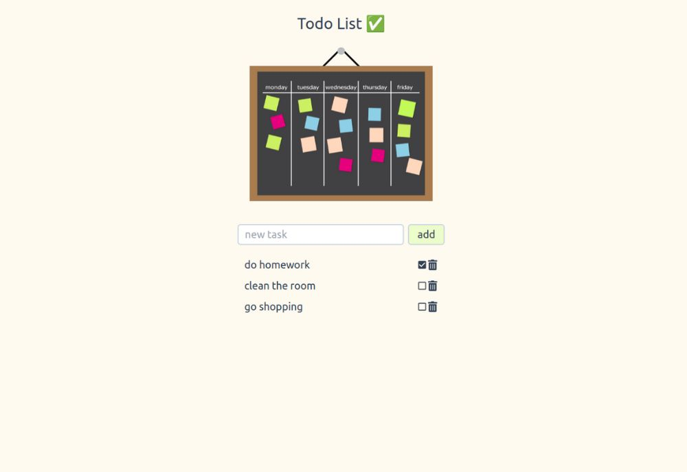

# Todo List 🗓✨
## Mini Application for Frontend-Backend Practice

### Tools I used
  
  
  
  
  
  
  
  
  
  

### Built using React with Vite
Crafted with React and turbocharged by Vite, this project is designed for optimal efficiency in code compilation and accelerated development speed.   

### Deployed on Render
Hosted on Render, the application enjoys a reliable and scalable deployment infrastructure.
This ensures a smooth user experience, allowing our project to scale effortlessly.

📝 Before you forget, make [Todo List](https://todo-mini-app.onrender.com/)✨